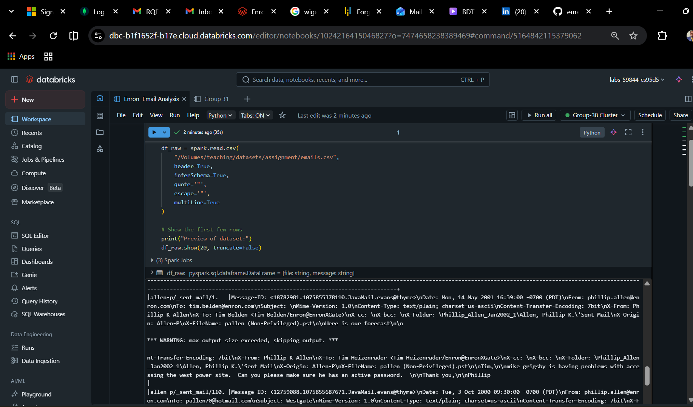
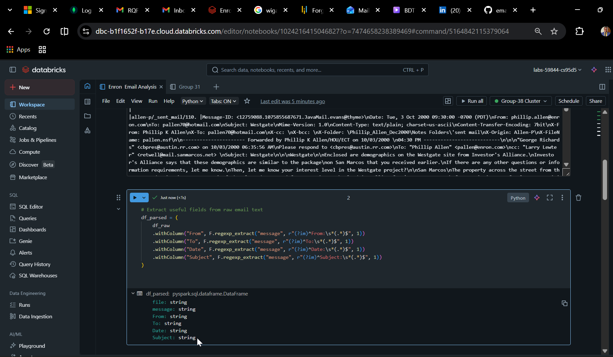
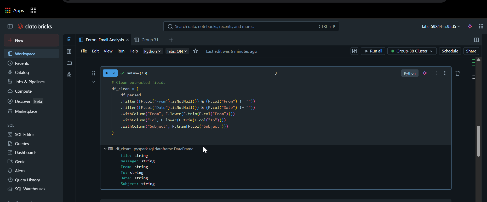
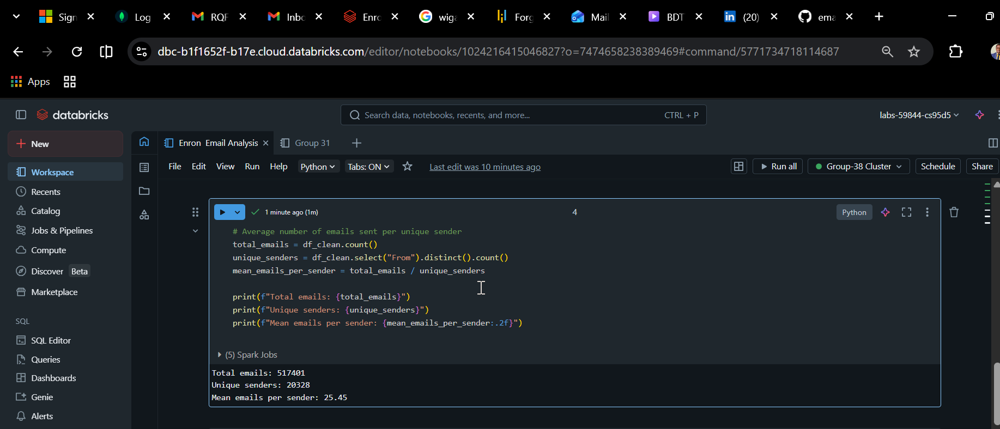
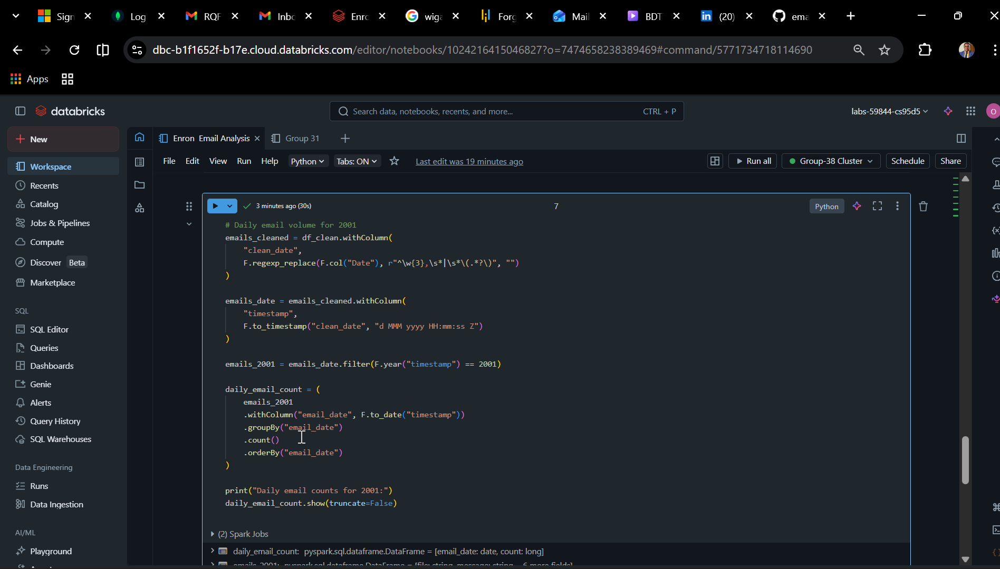
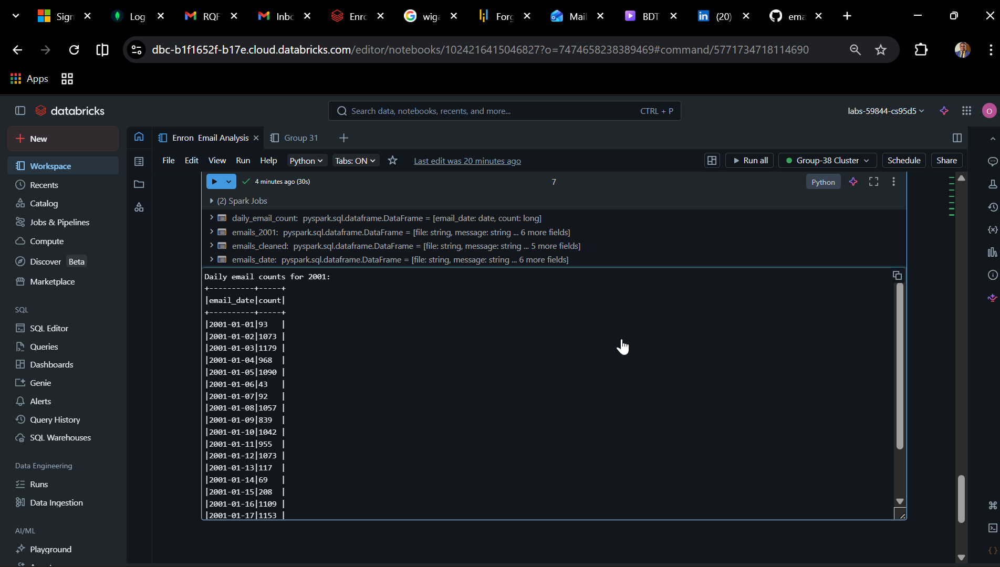

# 📧 Email Data Analysis using PySpark

## 📌 Overview
This project analyses email communication data using PySpark to understand sender activity and communication patterns.

---

## 🎯 Objective
The goal of this project is to:
- Analyse email data at scale
- Identify unique senders
- Calculate the average number of emails sent per sender
- Demonstrate data cleaning and aggregation using PySpark

---

## 🛠️ Tools & Technologies
- Python
- PySpark
- Databricks
- Spark SQL

---

## 📂 Dataset
The dataset contains email records with sender and recipient information.

---

## ⚙️ Project Steps

### 1. Data Loading
- Loaded email dataset into PySpark DataFrame

### 2. Data Cleaning
- Converted sender emails to lowercase to avoid duplicates

### 3. Data Analysis
- Counted total number of emails
- Identified number of unique senders
- Calculated mean emails per sender

### 4. Key Metric
Mean Emails Per Sender = Total Emails / Unique Senders

---

## 📊 Example Output
- Total Emails: XXXX  
- Unique Senders: XXXX  
- Mean Emails per Sender: XX.X  

(*Replace with your real results*)

---

## 💡 Key Insights
- Data cleaning is critical for accurate analysis  
- Duplicate variations (e.g., uppercase/lowercase) can distort results  
- PySpark efficiently handles large datasets  

---

## 📁 Project Structure

email-analysis-pyspark/
├── README.md
├── notebooks/
├── images/

---

## 🚀 Future Improvements
- Add visualisations (charts)
- Analyse top senders
- Extend to network analysis of email communication

---

## 👤 Author
Segun Olaoge

## 📸 Project Screenshots

### Data Loading

### Parsed Data

### Cleaned Data

### Mean Emails Per Sender

### Top Senders

### Daily Email Analysis Code

### Daily Email Counts (2001)

This analysis shows the volume of emails exchanged per day in 2001, the year Enron collapsed, highlighting communication trends over time.
